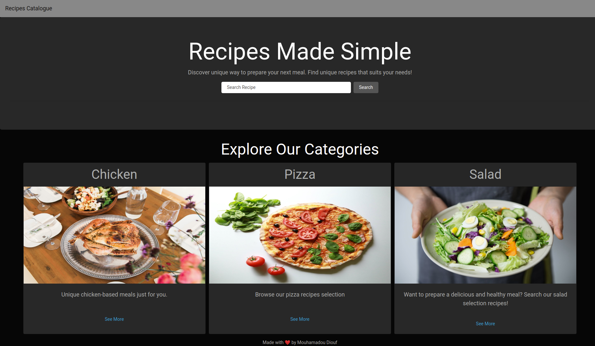

# Building a Recipe app with React & Redux.

## Technologies

- Node.js
- React
- React-DOM
- React-Create-App
- React Hooks
- React Router
- Eslint
- npm
- CSS

## Live Version 
<a href="https://react-meals-recipe.netlify.app/" target="_blank" > Live version </a>

## About the Project

The project is a recipe web app based on a catalog of recipes. It's a browsable list of meals you can filter and access the details of one item. 

## Developed by

Mouhamadou Diouf ( <a href="https://github.com/MouhaDiouf"> @mouhad </a>)

## Contributing

1. Fork it (https://github.com/MouhaDiouf/recipes-app)
2. Create your feature branch (git checkout -b feature/[choose-a-name])
3. Commit your changes (git commit -am 'What this commit will fix/add')
4. Push to the branch (git push origin feature/[chosen name])
5. Create a new Pull Request
